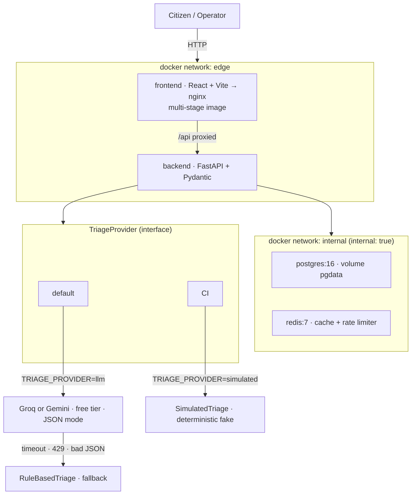

# CivicPulse

> Municipal complaint intake, triage and operations platform — CS4032 Software Construction and Design, Assignment 1.

<!-- Badges will be added once CI is configured -->

## Problem

Every municipality runs the same broken process: free-text complaints land in an undifferentiated queue sorted by arrival time, not urgency. A burst water main sits behind three streetlight complaints until a human reads it. By then, a street is flooded.

CivicPulse solves this by automatically triaging every complaint with an LLM — assigning a category, a priority and a one-line summary — and surfacing the result on a live operations dashboard. The triage reader is replaceable: keyword rules today, a hosted LLM tomorrow, a fine-tuned classifier next year. The system around it does not care which.

## Quickstart (one command)

```bash
git clone https://github.com/WrittenByAli/civicpulse.git
cd civicpulse
cp .env.example .env          # fill in GROQ_API_KEY (free at console.groq.com)
docker compose up --build
```

The system will be available at **http://localhost:3000**.
Seed data loads automatically on first start.

## Architecture



## API

| Method | Path | Description |
|--------|------|-------------|
| POST | `/api/complaints` | Submit and triage a complaint |
| GET | `/api/complaints/{id}` | Retrieve a single complaint |
| GET | `/api/complaints` | List with filters + pagination |
| PATCH | `/api/complaints/{id}/status` | Advance status (state machine enforced) |
| GET | `/api/stats` | Aggregate counts (Redis-cached, 30 s TTL) |
| GET | `/api/meta/providers` | Active triage provider + last 20 outcomes |
| GET | `/health` | Liveness probe (no DB) |
| GET | `/ready` | Readiness probe (Postgres + Redis) |
| GET | `/metrics` | Prometheus metrics |

## Documentation

- [Engineering Notes](docs/ENGINEERING-NOTES.md)
- [Runbook](docs/RUNBOOK.md)
- [AI Usage](docs/AI-USAGE.md)
- ADRs: [Provider Interface](docs/adr/0001-provider-interface.md) · [Frontend Config](docs/adr/0002-frontend-runtime-config.md) · [Deploy by SHA](docs/adr/0003-deploy-by-sha.md) · [PII Governance](docs/adr/0004-pii-and-data-governance.md)

## Team

- WrittenByAli
- shahzad-tech1
